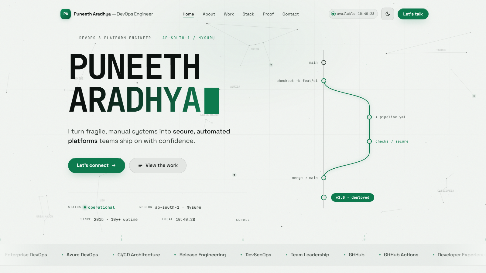

<div align="center">

# Puneeth Aradhya — Portfolio

**A portfolio built like a production system.**

Senior DevOps Engineer · 10+ years of making release day a non-event

[](https://aradhyapuneeth.github.io)
[](https://github.com/aradhyapuneeth/aradhyapuneeth.github.io/deployments)
[](LICENSE)
[](#the-engineering)
[](#run-it-locally)

<br>

<picture>
  <source media="(prefers-color-scheme: dark)" srcset=".github/preview-dark.png">
  <source media="(prefers-color-scheme: light)" srcset=".github/preview-light.png">
  
</picture>

*The screenshot follows your GitHub theme — the site ships the same dark/light pair.*

**[Visit the live site →](https://aradhyapuneeth.github.io)**

</div>

---

## 00 · The concept

Everything on the page speaks the language of delivery: the loader is a pipeline run, the career history is a `git log`, the metrics are a `git diff --stat`, the skills are a tracked `stack.yaml`, and the contact section is a `ping`. Even the sky is live telemetry.

| # | Section | What it is |
|---|---------|------------|
| boot | Preloader | A CI/CD run — **Build → Test → Deploy → Release** — with progress ticker and status log, then a curtain reveal |
| 01 | `whoami` | Identity card with 3D tilt + scan effect, ops manifesto, three operating principles |
| 02 | `git log --career` | Work history rendered as release tags (`release/2025.12 — HEAD`) |
| 02a | `git diff --stat` | The decade in numbers: 400+ apps supported, 120+ migrated, 19% infra footprint cut |
| 03 | `cat stack.yaml` | The toolchain as annotated YAML — hovering a card highlights its lines, and vice-versa |
| 04 | Proof | Certifications (all links verifiable), awards, education |
| 05 | `ping puneeth` | Contact CTAs + a terminal-style copy-to-clipboard email line |

## 01 · The details worth zooming into

- **The hero sky is real.** Not a random particle field — it's the actual night sky over Mysuru (12.2958° N, 76.6394° E) *right now*. A J2000 bright-star catalog (~70 stars, 15 constellations) is converted from equatorial to horizontal coordinates using local sidereal time, redrawn every 30 seconds, with a horizon compass and the occasional meteor. If Orion is above Mysuru, Orion is on the page.
- **A release, drawn live.** The hero's git graph animates a feature branch through checks to a `v2.0 · deployed` tag — hover a commit to see its hash appear on the cursor.
- **Text decodes into place.** The name scrambles through glyphs and settles left-to-right; hover the title to re-run it.
- **Two shifts, one room.** Light "day shift" by default, dark "night ops" one click away: a pre-paint boot script means zero flash, the choice persists in `localStorage`, and even the `<meta name="theme-color">` and canvas repaint along.
- **A quiet custom cursor.** Precise 1:1 dot with a trailing orbit ring; interactive elements label it with their action (`verify`, `copy`, `send`, a commit hash…).
- **Touches everywhere.** Magnetic buttons, pointer-tracked spotlight cards, a segmented skills marquee, scroll-spied nav with a progress bar, a live IST clock in two places.

## 02 · The engineering

No framework. No build step. No `node_modules`. What you see is what ships.

| Layer | Choice |
|-------|--------|
| Markup | One semantic `index.html` |
| Styles | One hand-written stylesheet — design tokens (CSS custom properties) power both themes |
| Behavior | Three small vanilla-JS files: `preloader.js`, `main.js`, `cursor.js` |
| Motion | [Lenis](https://github.com/darkroomengineering/lenis) smooth scroll via CDN — the **only** external dependency, loaded as progressive enhancement |
| Type | Space Grotesk + JetBrains Mono, self-hosted variable `woff2`, preloaded |
| Hosting | GitHub Pages, straight from `main` |

**Performance & accessibility, built in:**

- `prefers-reduced-motion` is honored everywhere — the preloader completes instantly, decode/canvas/marquee animations collapse gracefully
- Canvas renders at a capped device-pixel ratio and pauses when the tab is hidden
- `IntersectionObserver` drives reveals and scroll-spy; listeners are passive
- Skip-to-content link, ARIA labels and roles, `aria-current` nav state, `Esc` closes the menu
- SEO: JSON-LD `WebSite` / `ProfilePage` / `Person` graph (with `sameAs` profile links), Open Graph + Twitter cards, canonical URL, `rel="me"` identity links, `robots.txt` + `sitemap.xml`, Google & Bing site verification

## 03 · Repository layout

```
.
├── index.html                # the entire site — one page
├── req/
│   ├── css/styles.css        # tokens + every component, dark & light themes
│   ├── js/
│   │   ├── preloader.js      # CI/CD boot sequence
│   │   ├── main.js           # nav · theme · clock · reveals · star-map canvas
│   │   └── cursor.js         # custom cursor with action labels
│   ├── fonts/                # self-hosted variable fonts (woff2)
│   └── img/                  # profile photos + favicon set (incl. generator script)
├── robots.txt                # crawl rules + sitemap pointer
├── sitemap.xml
├── BingSiteAuth.xml          # search-engine verification
└── google*.html
```

## 04 · Run it locally

Nothing to install, nothing to build:

```bash
git clone https://github.com/aradhyapuneeth/aradhyapuneeth.github.io.git
cd aradhyapuneeth.github.io
python -m http.server 8000    # or: npx serve
```

Open `http://localhost:8000`. (Serve rather than double-clicking `index.html` so the self-hosted fonts load in every browser.)

## 05 · Make it your own

Fork-friendly by design — everything lives in three files:

1. **Content** — all copy is in `index.html`: hero, about, work timeline, stats, certifications, contact.
2. **Identity** — swap `req/img/profile*.png`, then regenerate favicons with `req/img/fav/make_favicons.py`.
3. **Look** — retune the design tokens at the top of `req/css/styles.css` (`--accent`, `--bg`, fonts, radii, easing).
4. **Metadata** — update the `<title>`, description, Open Graph tags, and JSON-LD schema in `<head>`.
5. **Analytics** — replace or remove the Google Tag Manager (`GTM-WRRMZSD9`) and GA4 (`G-JCZPXHQ705`) IDs.
6. **Verification** — delete `BingSiteAuth.xml` and `google*.html`; they belong to this deployment.

> [!NOTE]
> The **code** is MIT-licensed — take it, remix it, ship it. The **personal content** (photos, name, résumé details, credential links) is not part of the license; please replace it with your own.

## License

Released under the [MIT License](LICENSE) © 2026 Puneeth Aradhya.

---

<div align="center">

`deployed from Mysuru · status: operational`

[Website](https://aradhyapuneeth.github.io) · [LinkedIn](https://www.linkedin.com/in/puneeth-aradhya) · [Email](mailto:aradhyapuneeth@gmail.com)

</div>
