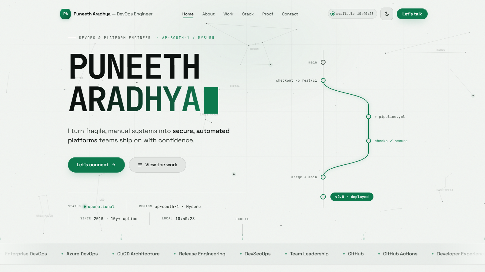

<div align="center">


# Puneeth Aradhya

**A portfolio built like a production system.**

Senior DevOps Engineer · Mysuru, IN · ten years of making release day a non-event

[](https://aradhyapuneeth.github.io)
[](https://github.com/aradhyapuneeth/aradhyapuneeth.github.io/commits/main)
[](#02--the-engineering)
[](#04--run-it-locally)
[](LICENSE)

<br>

<picture>
  <source media="(prefers-color-scheme: dark)" srcset=".github/preview-dark.png">
  <source media="(prefers-color-scheme: light)" srcset=".github/preview-light.png">
  
</picture>

<sub>The preview follows your GitHub theme. The site ships the same pair: <i>day shift</i> and <i>night ops</i>.</sub>

**[Open the live site →](https://aradhyapuneeth.github.io)**

[Concept](#00--the-concept) · [Details](#01--details-worth-zooming-into) · [Engineering](#02--the-engineering) · [Layout](#03--repository-layout) · [Run it](#04--run-it-locally) · [Fork it](#05--make-it-your-own)

</div>

---

## 00 · The concept

Every section speaks the language of delivery. The page doesn't load. It deploys:

```
puneeth@prod:~$ deploy --env production --portfolio

  ✓ build      compiling & building container images
  ✓ test       running unit & integration tests
  ✓ deploy     rolling out to production cluster
  ✓ release    verifying health checks

  ✓ deployment successful · live
```

After that, the career is a `git log`, the numbers are a `git diff --stat`, the toolchain is a tracked `stack.yaml`, and contact is a `ping`. Even the sky is live telemetry.

| # | Section | Rendered as |
|:--|:--|:--|
| `boot` | Preloader | A four-stage deploy with a progress ticker, a status log and a curtain reveal |
| `01` | `whoami` | Identity card with 3D tilt and scan line, a manifesto, and three operating principles |
| `02` | `git log --career` | Roles as release tags, from `release/2025.12 — HEAD` back to `release/2015.06` |
| `02a` | `git diff --stat` | The decade in numbers: 400+ apps supported, 120+ migrated, 19% infra footprint cut |
| `03` | `cat stack.yaml` | The toolchain as annotated YAML, cross-linked to three cards |
| `04` | `ls -la credentials` | Seven certifications with live verify links, three awards, and education |
| `05` | `ping puneeth` | Email and LinkedIn CTAs, plus a terminal line that copies the address |

## 01 · Details worth zooming into

- **The sky is real.** The hero isn't a particle field. It's the sky over Mysuru (12.2958° N, 76.6394° E) *right now*: 72 bright stars and 15 constellations, projected from J2000 coordinates through local sidereal time and recomputed every 30 seconds. The panorama faces south with a compass on the horizon. Constellation names appear only once most of their stars have risen. If Orion is up over Mysuru, Orion is on the page.
- **A release, drawn live.** The hero's git graph branches `feat/ci`, adds `pipeline.yml`, passes checks, merges, and tags `v2.0 · deployed`. A deploy pulse rides the branch the whole time. Hover a commit and the cursor reads its hash. (They're words.)
- **Text decodes into place.** The name scrambles through code glyphs (`#</>{}[]=+*^:~10`) and settles left to right without shifting width. Hover a line to run it again.
- **Two shifts, one room.** Light *day shift* is the default and dark *night ops* is one click away. A pre-paint script prevents any flash, and the choice persists in `localStorage`. `theme-color` and the star canvas repaint with the theme. In daylight, the `stack.yaml` terminal stays a night window.
- **A linked toolchain.** Hover a card and its YAML lines light up. Hover a line and its card responds. The last line, `mode:`, lights all three cards.
- **A quiet cursor.** A 1:1 dot with a trailing ring names the action under it: `verify`, `copy`, `send`, `open`, `map`, or a commit hash. It only appears on fine pointers; touch devices keep the native cursor.
- **Small things, everywhere.** Magnetic CTAs, pointer-tracked spotlights, a ±4° tilt on the ID card, a seamless skills marquee, scroll-spy navigation with a progress bar, and a live IST clock in two places. A meteor crosses the sky roughly every ten seconds.

> [!TIP]
> **Five things to try on the live site:** hover the commits in the hero graph · hover the `mode:` line in `stack.yaml` · flip to night ops and back · turn on *Reduce motion* in your OS and reload · come back in six hours, when the sky will have turned a quarter.

<details>
<summary><b>How the sky is computed</b></summary>

<br>

`main.js` carries a J2000 bright-star catalog (72 entries of `[RA hours, Dec°, magnitude]`) and 55 constellation line segments. Every 30 s, each star is converted from equatorial to horizontal coordinates for an observer at φ = 12.2958° N, λ = 76.6394° E:

```math
\begin{aligned}
d &= t_{\text{unix}}/86400 + 2440587.5 - 2451545.0 \\
\theta_{\text{LST}} &= 280.46061837^\circ + 360.98564736629^\circ\, d + \lambda \\
H &= \theta_{\text{LST}} - \alpha \\
\sin a &= \sin\delta\,\sin\varphi + \cos\delta\,\cos\varphi\,\cos H \\
\cos A &= \dfrac{\sin\delta - \sin a\,\sin\varphi}{\cos a\,\cos\varphi}
\end{aligned}
```

Azimuth is mirrored to 360° − A when sin H > 0. The result goes through a south-centred cylindrical projection: azimuth maps to x, altitude to y. Magnitude sets each star's radius and opacity. The six brightest (Sirius, Canopus, α Centauri, Arcturus, Vega and Capella) get a faint accent halo. Stars brighten as the pointer passes, and two layers of dust drift with parallax. Precession and refraction are ignored; at hero scale that's an error of a few pixels.

</details>

## 02 · The engineering

No framework. No build step. No `node_modules`. What you see is what ships.

| Layer | Choice |
|:--|:--|
| Markup | One semantic `index.html` |
| Styles | One hand-written stylesheet; design tokens (CSS custom properties) drive both themes |
| Behaviour | Three deferred vanilla-JS files: `preloader.js`, `main.js`, `cursor.js` (~32 KB, unminified) |
| Motion | [Lenis](https://github.com/darkroomengineering/lenis) 1.1.14 via jsDelivr, the only third-party library. It's optional: without it, anchors fall back to native smooth scrolling |
| Type | Space Grotesk + JetBrains Mono, self-hosted variable `woff2`, preloaded, `font-display: swap` |
| Texture | Film grain from an inline SVG `feTurbulence` data URI, with zero image requests |
| Analytics | Google Tag Manager + GA4 |
| Hosting | GitHub Pages, straight from `main`, so every push is a deploy |

The first-party payload is about **200 KB uncompressed**, counting HTML, CSS, JS and both fonts. The only photo is a lazy-loaded WebP.

**Built to degrade gracefully**

- **Reduced motion is a first-class mode.** With `prefers-reduced-motion` on:
  - The deploy completes instantly and the decode is skipped.
  - Lenis and the custom cursor stay off.
  - The marquee and git-graph animations stop.
  - The canvas renders a single still frame of the same live sky.
- **Nothing can trap you on the loader.** A 5.2 s watchdog forces the reveal if anything stalls, and the hero has its own fallback. The preloader removes itself from the DOM when it's done.
- **The canvas is frugal.** Device-pixel ratio is capped at 1.5 and the dust count scales with viewport area (max 150). Resizes are debounced, and the render loop stops while the tab is hidden. Reveals and scroll-spy run on `IntersectionObserver` rather than scroll math.
- **Accessible by structure.**
  - Skip link, and a `role="status"` loader with `aria-live`.
  - `aria-current` driven by scroll-spy, and an `aria-expanded` menu toggle that closes with `Esc`.
  - Decorative layers are `aria-hidden`, including the marquee's duplicated half.
- **Findable.**
  - A JSON-LD graph (`WebSite` → `ProfilePage` → `Person` with `sameAs`).
  - Open Graph and Twitter cards, a canonical URL, and `rel="me"` identity links.
  - `robots.txt` + `sitemap.xml`, plus Google and Bing verification.

## 03 · Repository layout

```text
.
├── index.html              # the whole site: one page
├── req/
│   ├── css/styles.css      # tokens + every component, both themes
│   ├── js/
│   │   ├── preloader.js    # the deploy sequence
│   │   ├── main.js         # nav · theme · clock · decode · reveals · sky canvas
│   │   └── cursor.js       # action-labelled cursor
│   ├── fonts/              # Space Grotesk + JetBrains Mono (variable woff2)
│   └── img/                # portraits · favicon set + generator script
├── .github/                # README previews
├── robots.txt
├── sitemap.xml
├── BingSiteAuth.xml        # search-console verification
├── google*.html            # search-console verification
└── LICENSE
```

## 04 · Run it locally

Nothing to install, nothing to build:

```bash
git clone https://github.com/aradhyapuneeth/aradhyapuneeth.github.io.git
cd aradhyapuneeth.github.io
python3 -m http.server 8000    # or: npx serve
```

Open `http://localhost:8000`. Serve it rather than double-clicking `index.html`, so the self-hosted fonts load in every browser. The site also works offline: Lenis and analytics are the only network calls, and both are optional.

## 05 · Make it your own

Fork-friendly by design: content lives in one HTML file, the look in one token block, and behaviour in three small scripts.

1. **Content.** Every word lives in `index.html`: hero, whoami, release log, `git diff --stat`, `stack.yaml`, credentials, and contact.
2. **Your sky.** Set `LAT` / `LON` in `req/js/main.js` and the clock's `timeZone: 'Asia/Kolkata'` next to them. Then update the coordinates printed on the ID card and the contact line in `index.html`.
3. **Identity.** Replace `req/img/profile*`, then regenerate the favicon set with `python3 req/img/fav/make_favicons.py`. It draws the monogram from vector strokes, so no font is needed; edit the strokes for your initials.
4. **Look.** Retune the tokens at the top of `req/css/styles.css`. Light-theme overrides live in `:root[data-theme="light"]`.
5. **Voice.**
   - The deploy log lines are the `plan` array in `req/js/preloader.js`.
   - The commit hashes are `data-cursor` attributes on the hero graph.
   - The `puneeth@prod` prompt is in `index.html`.
6. **Metadata.** Update the `<title>`, description, Open Graph and Twitter tags, JSON-LD, and `rel="me"` links in `<head>`.
7. **Analytics.** Replace or remove Google Tag Manager (`GTM-WRRMZSD9`) and GA4 (`G-JCZPXHQ705`).
8. **Verification.** Delete `BingSiteAuth.xml` and `google*.html`; they belong to this deployment.

<details>
<summary><b>Design tokens at a glance</b></summary>

<br>

| Token | Night ops | Day shift |
|:--|:--|:--|
| `--bg` |  `#08090b` |  `#f2f5f2` |
| `--ink` |  `#f4f6f8` |  `#0d1210` |
| `--accent` |  `#3ecf8e` |  `#0d7a4e` |

- **Type:** Space Grotesk (`--font-sans`) and JetBrains Mono (`--font-mono`).
- **Motion:** `--ease-out: cubic-bezier(0.23, 1, 0.32, 1)`; durations 140 / 220 / 320 / 520 ms.
- **Radii:** 10 / 14 / 20 px and a pill.

</details>

## Credits

- **Smooth scroll:** [Lenis](https://github.com/darkroomengineering/lenis) by darkroom.engineering (MIT).
- **Type:**
  - [Space Grotesk](https://github.com/floriankarsten/space-grotesk) by Florian Karsten (SIL OFL 1.1).
  - [JetBrains Mono](https://github.com/JetBrains/JetBrainsMono) by JetBrains (SIL OFL 1.1).
- **Motion:** easing curves after [Emil Kowalski](https://emilkowal.ski).
- **Co-author:** [Aradhyapavan H S](https://aradhyapavan.github.io/).

## License

The code is [MIT](LICENSE) © 2026 Puneeth Aradhya.

> [!NOTE]
> The **code** is MIT-licensed: take it, remix it, ship it. The **personal content** (photos, name, résumé details, credential links) is not part of the license, so please swap in your own.

---

<div align="center">

<sub><code>deployed from Mysuru · status: operational</code></sub>

[Website](https://aradhyapuneeth.github.io) · [LinkedIn](https://www.linkedin.com/in/puneeth-aradhya) · [GitHub](https://github.com/aradhyapuneeth) · [Devpost](https://devpost.com/aradhyapuneeth) · [Email](mailto:aradhyapuneeth@gmail.com)

</div>